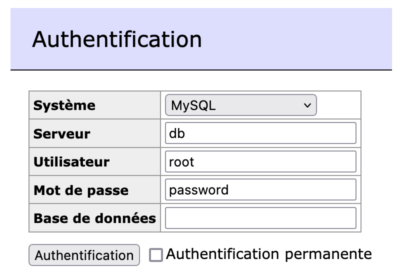

# node-bdd-template
Basic express server with mysql bdd and sequelize.

## Require:
- Docker and docker-compose [https://docs.docker.com/get-docker/]()
- Node and npm [https://nodejs.org/en/download/]() 

## Quick Start
First use: 
1. create `.env` from `.env.dist` 
2. run `npm install`

To start db: run `npm db:start` and open [http://localhost:8080/]() to have acces to an adminer to explore db. 

To start server: run `npm start` and open [http://localhost:3000/]()

## Environnement
You have to create `.env` from `.env.dist`.
- NODE_PORT: for server port
- FRONT_URL: for cors
- DB_TYPE: `mysql` (if you want use other, see `docker-compose.yml`)
- DB_HOST: `localhost` (if you want use other, see `docker-compose.yml`)
- DB_PORT: port used by mysql on your computer
- DB_USERNAME: user used by sequelize to explore db
- DB_PASSWORD: password used by sequelize to explore db
- DB_DATABASE: database used by sequelize to explore db

## Database
You can add initialisation sql in `/.docker/mysql/`

You can update mysql instance and option in `docker-compose.yml` [https://hub.docker.com/_/mysql]()

Stop database: `npm run db:stop`

Reset database: `npm run db:reset`

The db is completed with sequelize ([./src/models/index.js]() `sync()`)
